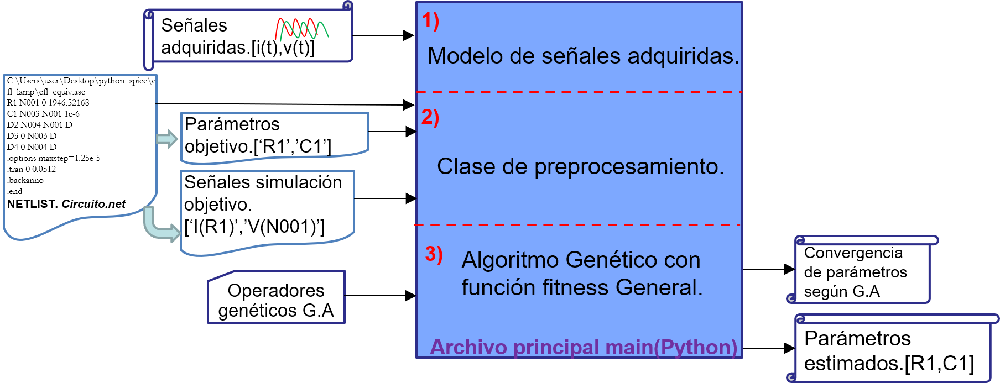

# python-ltspice-GA-estimation
Repositorio de trabajo de herramienta de estimación de dispositivos eléctricos basada en GA.

 La metodología interconecta técnicas de estimación en un lenguaje de programación(Python) con un programa de simulación (LTspice).La  estimación se basa en simulaciones iterativas que se comparan con una entrada o medidas hasta hallar los parámetros de salida, como se muestra en ek gisguiente diagrama.


## Funcionamiento

El flujo del trabajo inicia con la selección del dispositivo de su modelo eléctrico o de topología. En ese sentido su topología se dispone por medio de un modelado basado en Netlist en LTspice. De esa manera se carga el Netlist por medio de “strings” para manipular los parámetros a estimar y configurar el centro de control y procesamiento de Python con los respectivos parámetros objetivos.

Luego desde Python se inicia una rutina de estimación basado de G.A se crea una población de individuos basados en los parámetros objetivo. Así se da inicio al proceso iterativo basado en la técnica para estimar.

 En el proceso cada individuo se somete a una evaluación en el software de simulación. Desde Python se da la instrucción de script de consola donde por medio de comandos de consola se envía cada individuo a LTspice, se simula y se devuelve al centro de control la información de las señales eléctricas simuladas a Python. De ese modo se extraen las señales de simulación para manipularlas y compararlas con las señales medidas con una métrica de semejanza.
Cada individuo de parámetros tiene una evaluación en la que se mide si su simulación tiene semejanza a los datos medidos y así se emplea la técnica evolucionaria de inteligencia artificial sucesivamente hasta extraer el individuo que prevea el mejor parentesco con las señales medidas.
 Por último, luego de que el algoritmo de control haya encontrado la mejor solución en el proceso del algoritmo genético, se consolida el proceso y se puede dar como salida, los parámetros estimados con mejor ajuste de las medidas físicas del dispositivo eléctrico.

## Conocimientos previos recomendados

Para la utilización del repositorio se recomienda tener formación o conocimiento en las siguientes temáticas:
- Modelado y simulación en electrónica de potencia.
- Herramienta de simulación LTspice.
- Lenguaje de programación Python.

## Instalación


1. Instalar [Ltspice XVII](https://www.analog.com/en/design-center/design-tools-and-calculators/ltspice-simulator.html) en Windows 10.

2. Instalar [Python 3.7](https://www.python.org/downloads/) o superior.

3. Se recomienda instalar el paquete e manejo o núcleo [AnaConda](https://docs.anaconda.com/anaconda/install/windows/) que incluye Spyder para mayor facilidad de manejo de datos en optimización y estimación. 

4. Use el administrador de paquetes  [pip](https://pip.pypa.io/en/stable/) para instalar la librería [ltspice](https://pypi.org/project/ltspice/).

```bash

pip install ltspice
```

5. Descargar respositorio de trabajo [python-ltspice-GA-estimacion](https://github.com/johanv26/python_ltspice_GA_estimation) con código fuente de la herramienta en Github.


## Uso

Para la utilización de este repositorio se debe tener instalados los pasos previos del ítem anterior.

El proceso se basa en la ejecución del archivo principal *main_general_estimator.py*. Este script principal se compone de 3 secciones principales: Sección de adquirir señales en modelo de trabajo. Sección de crear ambiente de simulación con la clase de procesamiento. Y por último la sección de estimación por medio del algoritmo genético.

### 1) Modelo de señales adquiridas.
En esta sección se crea el modelo de medidas a partir de la clase Model. Esta clase permite leer señales de adquisición guardas en formato *.csv.*  De esa forma, se entregan como argumento de entrada el nombre del archivo para adquirir las dos instancias principales del modelo: tiempo y lista de señales . Por otra parte, la clase tiene el parámetro bandera opcional  *measure=True*, que en True indica para ser tomado por referencia y guardarse por el proceso.
```python
#%%Measure data recolection model class

signals_file='values_noise.csv'
n=4

signal_name=['v1','i1','v2','i2']
measure=Model.read_csv_signal(signals_file,4)
measure_model=Model(measure.time,measure.signals[1:],measure=True)
```
La herramienta se basa en estimar los parámetros de un disipativos eléctricos a partir de un modelo eléctrico de simulación.
Por tal motivo el codigo principal utiliza como base la formulación de un circuito de simulación en netlist para estimar. 

### 2) Clase de preprocesamiento  para simulación
Esta clase es la que configura el escenario de simulación y las características para realizar los flujos iterativos. Para ello se ingresan el mapa del circuito en LTspice como el netlist y el archivo de graficas con extensión *.raw.* Se incluyen un vector que indica los parámetros objetivo en string con el nombre correspondiente que poseen en el netlist. Por último , se ingresa las señales en el formato visto según LTspice. Es el caso de corrientes y tensión usando corriente de elemento *'I(R1)'* y definición de tensión de nodo *'V(n004)'*. Estas señales se analizan por el usuario para que correspondan con las señales adquiridas para contrastar una por una por la métrica fitness.
```python
#%%Pre process class to configure the case

sim_name='trafo_single'
sim_raw='/'+sim_name+'.raw'
netlist_path= r'C:\Users\user\Desktop\python_spice\trafo\trafo_single.net'
parameters=['R1','R2','L1','L2','L3']
signals2=['I(R1)','V(n004)','I(L4)']

simu_data=SimulationInfo(netlist_path,sim_raw,parameters,signals2,norm=True)
```

### 3) Método de algoritmo genético(G.A) 
En esta sección se define las características para trabajar o dar convergencia de la estimación según el algoritmo genético.
Se declara la función objetivo o fitness que utilizara el algoritmo genético. Para ello se utiliza la función fitness general basada la definición RMSE de cada señal entre medidas y simulación. 

Si se utiliza mas de una señal para estimar, se construye un vector de RMSE y se calcula norma 2 de este vector como función fitness objetivo:


Por ultimo se define los operadores genéticos y parámetros de un algoritmo genético. Es el caso del tamaño de la población, tase de cruce, tase de mutación, bits de definición , criterio de parada en iteraciones. También se incluye la información relacionada con los parámetros y su búsqueda, es el caso de indicar el número de parámetros y el rango de las variables para realizar el proceso de estimación.


```python
#%%----------------------------GA------------------------------
popu_size=100
xover_rate=0.98
mut_rate=0.02
bit_n=10
stop_criteria=20

fitness_fcn= 'fitnessGeneral'
var_n=5

rango=np.array([[1e-3,10],
                [1e-3,2000],
                [1e-6,2],
                [1e-6,2],
                [1e-6,2]])


popu,upper=geneticAlgoritm(fitness_fcn, var_n, rango, popu_size, xover_rate,
                           mut_rate, bit_n, stop_criteria)
```
## Contribución
Todas los requests o peticiones de colaboración son bienvenidas. Para mayor cambios, por favor abrir una discusión para tratar el tema o item posible a modificar.

## Autores y reconocimiento
Este repositorio fue desarrollado por Johan Castiblanco, ingeniero electrónico. Se reconoce al grupo de investigación GICEP de la Universidad Nacional de Colombia sede Manizales, por su formación y acompañamiento en temáticas relacionadas con electrónica de potencia y modelado y simulación. 
Se agradece también por la  colaboración a los doctores Andres Felipe Guerrero y Armando Ustariz en el proceso.

## License
[MIT](https://choosealicense.com/licenses/mit/)
